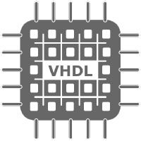

# 👋 Olá, Bem Vindo ao meu perfil do GitHub. 

## Eu sou o Isaac 🐌, algumas pessoas me chamam de Newton.

 - Sou estudante de Engenharia da Computação (8° Período) na

    
 
 - Sou técninco em Eletrônica e técnico em Automação Industrial pela

    

## Estudando Atualmente:
 - Disciplinas Relacionadas a Computação:
    - Laboratório de Badse de Dados
    - Projetos em Sistemas Embarcados
    - Processamento de Linguagem Natural

 - Disciplinas Relacionadas a Elétrica:
    - Comunicação Digital
    - Controle Digital
    - Linguagens de Descrição de Hardware
    - Fundamentos de Semicondutores
    - Projetos de Circuitos Integrados Digitais I

 <!-- - Outras disciplinas de Engenharia da Computação (do 7° Período):
    - Gestão Ambiental -->

- Linguagens e Ferramentas:

</a>   
</a>  

 

## Estatísticas do meu Perfil:

## Contato:

   
